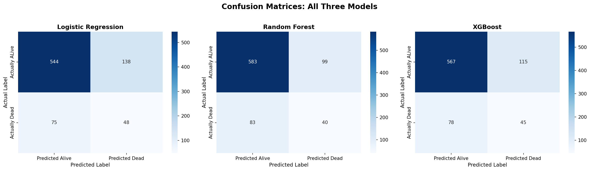
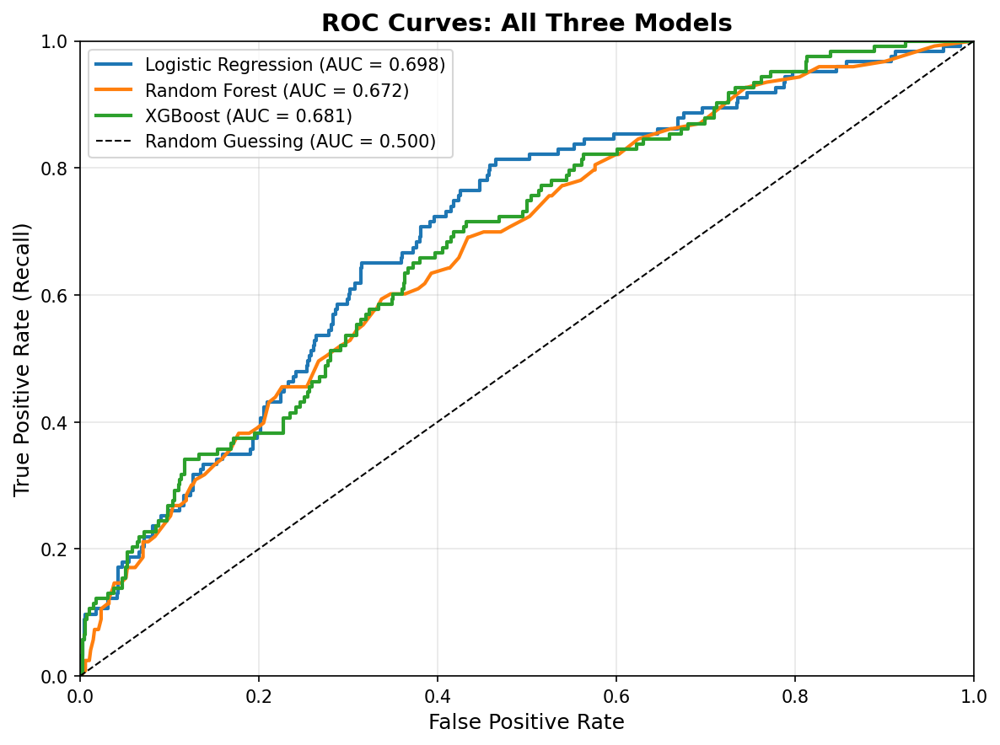
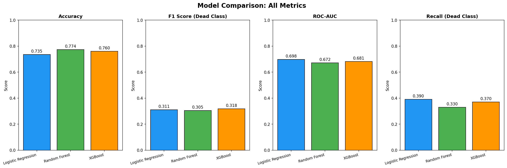
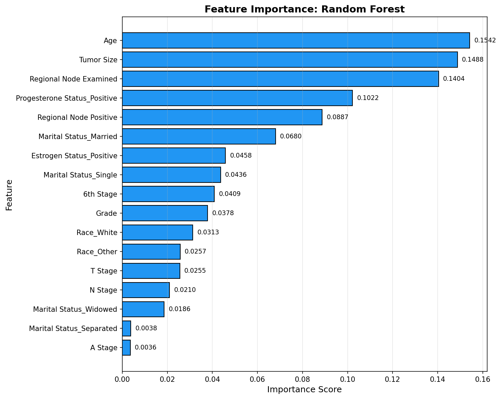

# Breast Cancer Survival Outcome Prediction
## Clinical Risk Stratification Using Machine Learning: A Comparative Study

## Overview

This project builds and evaluates three machine learning models to predict breast cancer survival outcomes from clinical features recorded at diagnosis. Using 4,024 real patient records from the US National Cancer Institute SEER registry, the project compares Logistic Regression, Random Forest, and XGBoost classifiers on a binary survival prediction task (Alive vs Dead).

## Clinical Motivation

Identifying high-risk breast cancer patients at the time of diagnosis is critical for oncologists making treatment planning decisions. A model that can predict survival outcome from routinely collected clinical measurements could support earlier intervention for patients most at risk.

However, such models face two fundamental challenges that this project investigates directly:

1. **Class imbalance**: the majority of patients survive, making standard accuracy metrics misleading and requiring specialised techniques
2. **Data scarcity**: individual hospitals hold small patient datasets that cannot be shared across institutions due to privacy regulations

The data scarcity challenge directly motivates federated learning approaches, where models are trained across distributed hospital nodes without sharing patient data.

## Dataset

**Source:** SEER Breast Cancer Dataset, US National Cancer Institute

**Access:** [Kaggle, reihanenamdari/breast-cancer](https://www.kaggle.com/datasets/reihanenamdari/breast-cancer)

**Patients:** 4,024 female patients with infiltrating duct and lobular carcinoma breast cancer diagnosed 2006 to 2010

**Target:** Vital status, Alive (0) or Dead (1)

**Note:** The dataset CSV file is not included in this repository. Please download it from the Kaggle link above, place it in the `data/` folder, and rename it to `Breast_Cancer.csv`.

### Features Used

| Feature | Type | Description |
|---|---|---|
| Age | Numerical | Patient age at diagnosis |
| Tumour Size | Numerical | Tumour size in millimetres |
| Regional Node Examined | Numerical | Number of lymph nodes examined |
| Regional Node Positive | Numerical | Number of positive lymph nodes |
| T Stage | Ordinal | Tumour size stage (T1 to T4) |
| N Stage | Ordinal | Lymph node involvement (N1 to N3) |
| 6th Stage | Ordinal | Overall AJCC cancer stage |
| Grade | Ordinal | Tumour cell differentiation (1 to 4) |
| A Stage | Binary | Regional vs Distant spread |
| Estrogen Status | Binary | Hormone receptor status |
| Progesterone Status | Binary | Hormone receptor status |
| Race | Categorical | Patient race |
| Marital Status | Categorical | Marital status at diagnosis |

## Project Structure

    breast-cancer-survival-ml/
        data/
            Place downloaded CSV here (not tracked by Git)
        notebooks/
            01_data_exploration.ipynb
            02_preprocessing.ipynb
            03_model_training.ipynb
            04_evaluation.ipynb
        outputs/
            processed_data/
            figures/
            models/
        requirements.txt
        README.md

## Methodology

### 1. Data Exploration
- Loaded and profiled 4,024 patient records across 16 columns
- Identified class imbalance: 84.7% Alive vs 15.3% Dead
- Identified column typo (Reginol to Regional) and trailing space in T Stage

### 2. Preprocessing
- Fixed column name issues
- Dropped Survival Months column to prevent data leakage
- Dropped differentiate column as it was redundant with Grade
- Applied ordinal encoding to staged clinical features
- Applied one-hot encoding to nominal categorical features
- Performed 80/20 stratified train/test split
- Applied SMOTE to training data only to address class imbalance

### 3. Model Training

Three models were trained and compared:

- **Logistic Regression**: with StandardScaler and class_weight balanced
- **Random Forest**: 100 trees with class_weight balanced
- **XGBoost**: 100 boosting rounds with scale_pos_weight for imbalance

### 4. Evaluation
- Confusion matrices, ROC curves, and classification reports
- Feature importance analysis using Random Forest
- Subgroup analysis by tumour stage and estrogen receptor status

## Results

### Model Comparison

| Metric | Logistic Regression | Random Forest | XGBoost |
|---|---|---|---|
| Accuracy | 0.7354 | 0.7739 | 0.7602 |
| F1 Score (Dead) | 0.3107 | 0.3053 | 0.3180 |
| ROC-AUC | 0.698 | 0.672 | 0.681 |
| Recall (Dead) | 0.390 | 0.330 | 0.370 |

### Confusion Matrices

### ROC Curves

### Model Comparison Chart

## Key Findings

### Feature Importance

Age, Tumour Size, and Regional Node Examination emerged as the three strongest predictors of survival outcome, consistent with established oncological literature. Hormone receptor status contributed meaningfully, reflecting the biological distinction between hormone-driven and triple-negative breast cancers.

### Subgroup Analysis

| Subgroup | F1 (Dead) | Recall (Dead) |
|---|---|---|
| Early Stage (IIA to IIB) | 0.168 | 0.205 |
| Late Stage (IIIA to IIIC) | 0.409 | 0.456 |
| Estrogen Positive | 0.253 | 0.274 |
| Estrogen Negative | 0.593 | 0.941 |

Substantial performance variation was observed across patient subgroups. The model performed significantly better on late stage and estrogen negative patients, which are groups with more clinically distinctive features. This heterogeneity highlights a key limitation of centralised models trained on aggregated data.

## Limitations and Future Work

All three models achieved modest performance on the minority Dead class (F1 approximately 0.31), reflecting the inherent difficulty of survival prediction from clinical features alone. Key limitations include:

- **Feature scope**: clinical features only, without genomic or imaging data
- **Centralised training**: assumes all data is available in one place
- **Subgroup variation**: model performs inconsistently across patient groups

These limitations motivate research on privacy-preserving federated deep learning for cancer outcome prediction, where multimodal data including clinical, genomic, and imaging data is learned across distributed hospital nodes without sharing patient records.

## How To Run

### Prerequisites

Install all required libraries:

    pip install -r requirements.txt

### Dataset Setup

1. Download the SEER Breast Cancer Dataset from [Kaggle](https://www.kaggle.com/datasets/reihanenamdari/breast-cancer)
2. Place the CSV file in the `data/` folder
3. Rename it to `Breast_Cancer.csv`

### Running The Notebooks

Run the notebooks in order:

1. 01_data_exploration.ipynb
2. 02_preprocessing.ipynb
3. 03_model_training.ipynb
4. 04_evaluation.ipynb

## Requirements

- pandas
- numpy
- matplotlib
- seaborn
- scikit-learn
- xgboost
- imbalanced-learn
- joblib
- jupyter

## Author

**Ravindu Denuwan Godage**
